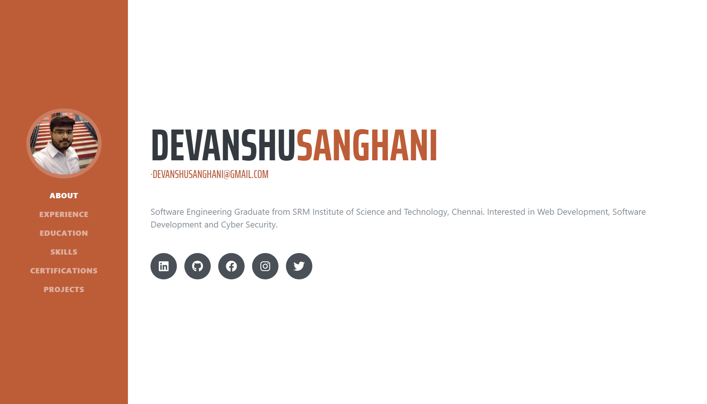

# Portfolio
## Built using React

serviceworker is build using [https://www.pwabuilder.com/](https://www.pwabuilder.com/)

The hosted version of this repository is live at [http://devanshusanghani.me](http://devanshusanghani.me)

## Steps to run locally
1. Clone the repository using `git clone https://github.com/devanshusanghani/portfolio.git`
2. `cd` into the cloned repository and run `yarn`. This will install all the dependencies required for the project.
3. Run the server using `yarn start`.
4. Create your own portfolio by editing the `profileData.json` present in the `src` directory.
5. Place your image in `Assets` directory present inside `src` directory. Make sure to rename it to `profile.jpg` or else you can edit the filename in `import` statement of `Sidebar.js` Component.

## Steps for add this into your github
1. Go to your project's root directory.
2. Initial it by typing `git init`.
3. Create an empty repository with name `githubusername.github.io` (replace githubusername with your githubusername) or any other name.
4. Copy the git link for your repo and add it to your local git repo as follows : `git remote add origin <git link>`.
5. If you are using custom domain then create a file with name CNAME in the root of your directory and add your domain name to it, in the format domain.com and save it.
6. Add 2 scripts predeploy and deploy to your scripts in package.json as follows : 
        `"predeploy": "yarn run build", `
        `"deploy": "gh-pages -d build"`
7. Both the scripts should be inside the `scripts` key of `package.json`.
8. Also create `.env` file and set `PUBLIC_URL=yourcustomdomain.com` and place it in the root folder.
9. Run `yarn run deploy` this will deply your site to yourcustomdomain.com.
10. Push your code to master by doing the following steps: 
        `git add -A`
        `git commit -m "Push portfolio code"`
        `git push origin master`

## Blog Post

This project was bootstrapped with [Create React App](https://github.com/facebook/create-react-app).  
The Bootstrap template used in this tutorial is [https://github.com/BlackrockDigital/startbootstrap-resume](https://github.com/BlackrockDigital/startbootstrap-resume)
Follow the medium link for additinal info : [https://levelup.gitconnected.com/create-a-portfolio-using-react-and-github-student-developer-pack-955379207855](https://levelup.gitconnected.com/create-a-portfolio-using-react-and-github-student-developer-pack-955379207855)
